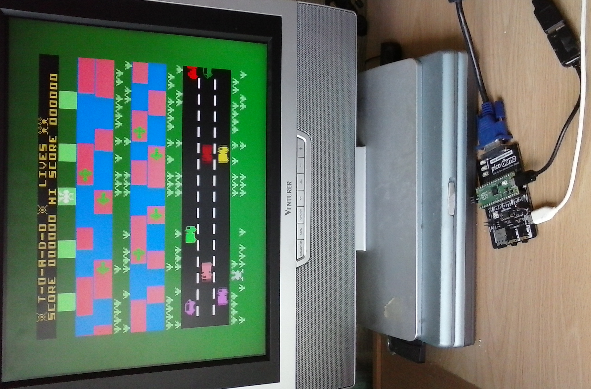

# MEMU - Memotech EMUlator

The [Memotech MTX](https://en.wikipedia.org/wiki/Memotech_MTX) series of computers were superior
8-bit computers of the 1980s. Although initially supplied with a ROM BASIC later addons included
disk drives of various formats, which could be accessed from extensions to the ROM BASIC or the
system could boot CP/M 2.2.

The definitive source of information about Memotech computers is
[Dave Stevenson's site](http://primrosebank.net/computers/mtx/mtx512.htm).

MEMU is a full featured emulator of the MTX systems originally written by
Andy Key. Andy's version of MEMU is available for Microsoft Windows or Linux from
[here](http://www.nyangau.org/memu/memu.htm).

This repository was originally just a port of MEMU to run on a Raspberry Pi Pico.
It now includes all my current ports of MEMU. It includes versions for:

* Raspberry Pi Pico: A cut-down version due to Pico capacity limits.
* Linux X-Window: Displays in multiple windows.
* Linux Framebuffer: No GUI required. One display at a time, full-screen.
* Microsoft Windows: Does not have DART or Network emulation.
* Experimental version using SDL3. SDL3 has support for Wayland.
  It may also provide a single source usable on Windows & Linux, including Networking.
* OBSOLETE: Raspberry Pi: A Linux build with the ability to use GPIO to connect additional hardware.
  *Not compatible with recent RPi OS*
* OBSOLETE: Bare-Metal Raspberry Pi: Runs without any operating system using the Circle library.
  *Uses old version of Circle - Not compatible with recent RPi hardware*

Work is still needed to clean the code. There are probably bugs, and there is certainly
diagnostic code.

For build and usage information, see the [documentation](https://memotech-bill.github.io/MEMU/).

The game "TOADO" on MEMU running on a Raspberry Pi Pico.

## Licence

To conform with the terms of Andy Key's original release, all the MEMU specific code is
released according to the [Unlicense](https://unlicense.org/).

This port of MEMU relies on other open source software which is subject to other terms,
see appropriate source files:

* FatFS - Copyright (C) 20xx, ChaN
* Z80 Emulation - Copyright (C) Marat Fayzullin 1994,1995,1996,1997
* Circle Bare-Metal libraries - Copyright (C) 2014-2020  R. Stange <rsta2@o2online.de>
